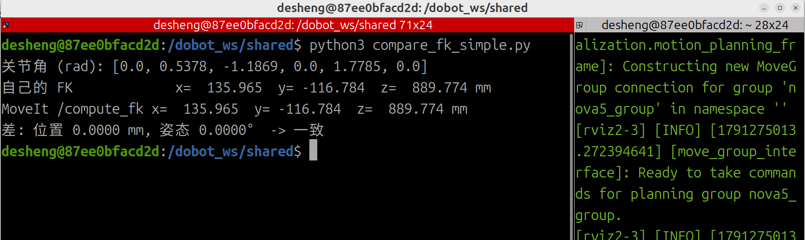

# 06 自己实现 FK,并与 MoveIt `/compute_fk` 对比验证

> 对应 M2 任务 1(implement and verify FK/IK)的 FK 部分。
> 本篇回答三个问题:FK 是怎么从 URDF 算出来的?`/compute_fk` 是什么、怎么调用?两者对比能证明什么、不能证明什么?

## 1. 目标

给定 6 个关节角 q1…q6,自己算出 `base_link → Link6` 的位姿,再让 MoveIt 用同一组关节角算一次,比较位置差(mm)和姿态差(度)。

## 2. FK 原理:沿 URDF 关节链连乘

URDF 里每个关节有两样东西:

- `origin`(`xyz` + `rpy`):这个关节坐标系相对**上一个连杆坐标系**的**固定**安装位姿,由装配决定,不随运行变化。单位:米、弧度。
- `axis`:关节绕哪根轴转,用**关节自己的坐标系**表示。Nova5 的 6 个关节都是绕自己的 z 轴。

第 i 个关节的变换:

```
base_T_Link(i) = base_T_Link(i-1) · Trans(xyz_i)·Rot_rpy(rpy_i) · Rot_axis(axis_i, q_i)
                 └── 上一段累积 ──┘ └────── 固定安装 ──────┘ └──── 关节转动 ────┘
```

从右往左读:离点最近的变换先发生。6 个关节连乘完,最后一个就是 `base_T_Link6`。

### 2.1 `rpy`

roll、pitch、yaw,分别绕 x、y、z。URDF 的约定是绕父坐标系的**固定轴**,先 x、再 y、最后 z,写成矩阵就是:

```
R = Rz(yaw) · Ry(pitch) · Rx(roll)
```

### 2.2 `axis` 与 Rodrigues 公式

URDF 允许关节轴是任意方向,所以用 Rodrigues 公式求“绕单位轴 a 转 θ”的旋转矩阵:

```
R = I + sinθ · K + (1 − cosθ) · K²        K = a 的反对称矩阵,K v = a × v
```

推导思路:把向量拆成“平行于轴”和“垂直于轴”两部分,平行部分不变,垂直部分在垂直平面内转 θ。当轴取 z 轴时,它就是常见的 `Rz(θ)`。

### 2.3 代码里的对应

`nova5_model.py` 中的关键循环:

```python
for i, ((xyz, rpy), axis) in enumerate(zip(_COMMON_ORIGINS, _AXES[model])):
    T = T @ _T(_rot_rpy(rpy), xyz) @ _T(_rot_axis(axis, q[i]), (0, 0, 0))
    out.append(T.copy())
```

- `_COMMON_ORIGINS`:从 URDF 原样抄来的 6 组 `(xyz, rpy)`。
- `_rot_rpy`、`_rot_axis`:生成 3×3 旋转矩阵;`_T(R, p)` 把旋转和平移打包成 4×4 齐次矩阵。
- `out` 保存 base 到 Link1…Link6 的各个累积变换,`fk(q)` 取最后一个。

## 3. MoveIt `/compute_fk` 是什么

- 它是 `move_group` 自带的**服务**(不是 Action),类型 `moveit_msgs/srv/GetPositionFK`。查看方式:

```bash
ros2 service list -t | grep -i fk
ros2 interface show moveit_msgs/srv/GetPositionFK
```

- 请求要填:
  - `header.frame_id = "base_link"`:结果以 base_link 为参照。
  - `fk_link_names = ["Link6"]`:要算哪些连杆坐标系的位姿(可填多个,返回列表)。
  - `robot_state.joint_state`:6 个关节名和关节角。**它也需要关节角**,不给就算不了。
- 响应的 `pose_stamped[0].pose` 含 `position`(米)和 `orientation`(四元数 x, y, z, w)。
- 它用的是 `move_group` 启动时加载的那份 URDF 做内部 FK。

## 4. 对比脚本 `compare_fk_simple.py`

流程:

1. 取命令行的 6 个关节角(不给则用 home)。
2. `fk(q)` 得到自己的 4×4 矩阵 `T_own`。
3. 创建节点,`create_client(GetPositionFK, "/compute_fk")` 创建服务客户端,等服务上线后发请求。
4. 把响应的四元数转成 3×3 旋转矩阵、位置放进最后一列,拼成 `T_mv`。
5. 计算差值:

```python
dpos = np.linalg.norm(T_own[:3,3] - T_mv[:3,3]) * 1000          # 位置差,mm
dang = np.degrees(np.linalg.norm(
    Rotation.from_matrix(T_own[:3,:3].T @ T_mv[:3,:3]).as_rotvec()))  # 姿态差,度
```

姿态差的含义:`R_own.T @ R_mv` 是“从自己的姿态转到 MoveIt 的姿态”的相对旋转(由 `R_mv = R_own · R_rel` 两边左乘 `R_own.T` 得到,旋转矩阵的逆等于转置);`as_rotvec()` 把它写成“轴 × 角”,向量长度就是转角。两姿态相同时为 0°。

## 5. 运行方法

只需要 `move_group` 在运行,**不需要 Gazebo,机械臂不会动**。

终端 1(容器内):

```bash
export DOBOT_TYPE=nova5
ros2 launch dobot_moveit moveit_demo.launch.py
```

终端 2(再进同一个容器):

```bash
python3 compare_fk_simple.py 0.3 0.2 -0.8 0.1 1.0 -0.2
```

脚本放在共享目录(容器内 `/dobot_ws/shared/`),`nova5_model.py` 要在同一目录。

## 6. 运行结果



<!-- 把终端里的输出粘贴到下面的代码块里 -->

```
(在这里粘贴 compare_fk_simple.py 的终端输出)
```

参考(只用自己的 FK、不需要 ROS 即可复现,单位 mm):

| 关节角 | 自己的 FK 位置 x / y / z |
|---|---|
| home `[0, 0.5378, -1.1869, 0, 1.7785, 0]` | 135.965 / −116.784 / 889.774 |
| `[0.3, 0.2, -0.8, 0.1, 1.0, -0.2]` | 273.366 / −106.703 / 974.064 |

脚本最后一行会给出“差: 位置 … mm, 姿态 …°”,并按 1 mm / 0.1° 的阈值判断“一致/不一致”。

## 7. 这个对比能证明什么、不能证明什么

能证明:

- 自己的连乘公式、`rpy` 顺序、轴向、Rodrigues 实现没有写错(同一份 URDF,两种算法的结果一致)。

不能证明:

- **URDF 本身和真实机械臂一致**。两边用的都是 URDF,模型错了会一起错。这要靠真机控制器读数(`GetPose`)来验证。
- 比较的是 **Link6 坐标系**的原点,不是工具尖端。接上夹爪后需要再乘一个固定的工具偏移。

## 8. 后续

- IK:往返验证已做(随机 q → FK → IK → FK),与 MoveIt `/compute_ik` 的逐点对比尚未做。
- 真机:读控制器 `GetPose` 与自己的 FK 对比,同时确认真机关节 1、4 的正方向与 MoveIt 版 URDF 一致。
- 向导师确认 FK/IK 验证的预期形式。
