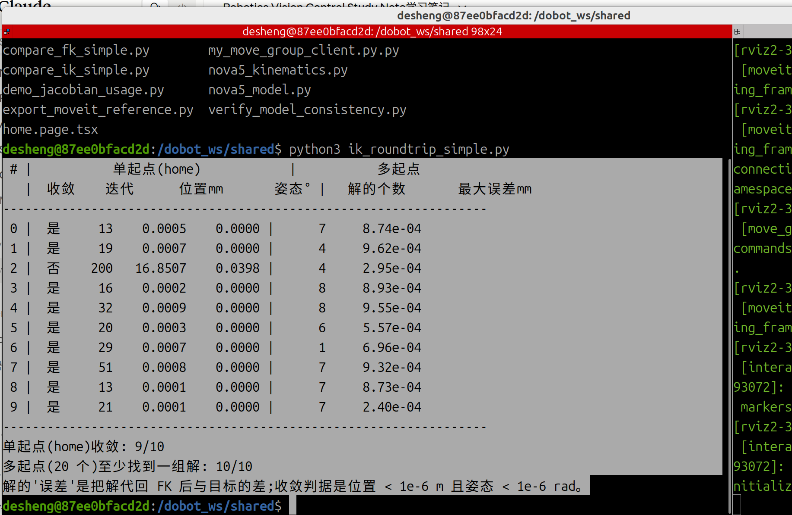
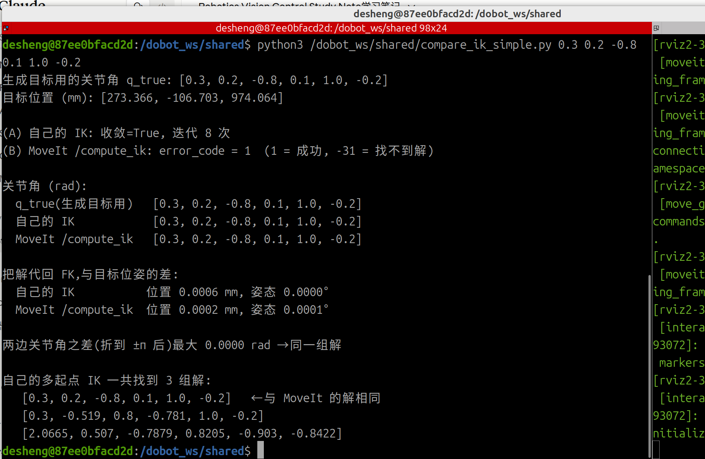

# 08 逆运动学(IK):原理、实现与验证

> 对应 M2 任务 1(implement and verify FK/IK)的 IK 部分。FK 见第 6 篇,Jacobian 与奇异性见第 7 篇。
> 本篇回答:IK 为什么难?数值 IK 怎么一步步算?阻尼最小二乘、步长限制、关节限位、多起点各起什么作用?"起点"到底是什么?自己的 IK 怎么验证,和 MoveIt `/compute_ik` 比结果如何?

## 1. IK 要解决什么

- FK:关节角 `q` → 末端位姿 `T`。一定有解,一次算出。
- IK:目标位姿 `T` → 关节角 `q`。反过来求,难在两点:
  - **可能多解**:二连杆到 (1,1) 有 (0°, 90°)(肘朝下)和 (90°, −90°)(肘朝上)两组;Nova5 同一个目标位姿通常有多组关节角(测试中 1~8 组)。
  - **可能无解**:目标超出可达范围或关节限位。

简单结构可以用几何/三角函数推公式(**解析解**,如二连杆的余弦定理)。Nova5 的 URDF 里有各种偏置和倾斜(很多非零 `rpy`),写不出简单公式,所以用**数值解**。

## 2. 数值 IK:用 Jacobian 一步步逼近

思路就是第 7 篇的 `Δp ≈ J·Δq` 反过来用(牛顿法):

```
误差 e = 目标位姿 − 当前位姿(6 维:位置差 3 个 + 姿态差 3 个)
希望 J·Δq ≈ e   →   Δq = J⁻¹·e
```

循环:

1. 用 FK 算当前末端位姿;
2. 算误差 `e`;
3. `e` 足够小就停;
4. 否则 `q ← q + Δq`,回到 1。

**二连杆演示**(目标 (1,1),普通 `J⁻¹`,表中是每步误差长度 |e|):

| 迭代 | 起点 θ=(0.3, 1.0) | 起点 θ=(1.0, −1.0) |
|---|---|---|
| 0 | 0.342 | 0.563 |
| 1 | 0.103 | 0.210 |
| 2 | 0.0031 | 0.0177 |
| 3 | ≈0 | 0.00016 |
| 最终 | θ=(0°, 90°) | θ=(90°, −90°) |

误差越来越快地缩小;两个起点收敛到**两组不同但都正确**的解。

## 3. "起点"是什么(容易误解)

- **IK 只是计算,机械臂不动。** 它的输出 `q_goal` 是"末端到达目标位姿时,每个关节的角度"。
- **起点 `q_guess` 是算法的初始猜测**,不是机械臂当前的状态。数值方法必须"先猜一个再修正",就像用牛顿法解 `x² = 4`:从 1 猜起得 2,从 −1 猜起得 −2,起点和"你现在在哪"无关。
- **答案是绝对的关节角**(从各关节零位量起),不是"相对起点再转多少"。迭代里 `q = q + Δq` 看起来是相对的,但结束时 `q` 存的就是完整的关节角:`q_goal = q_guess + Σ修正`。
- **从 home 出发每个关节要转多少** = `q_goal − home`。起点在 IK 结束后就不再使用。
- **真正的运动**:MoveIt 规划 home → `q_goal` 的路径(OMPL,考虑避障、限位),再交给控制器执行。

例(关节 2,数字为假设):home = 0.5378,随机起点 = −1.0,迭代修正总和 = +1.2 → `q_goal` = 0.2 → 从 home 要转 0.2 − 0.5378 = −0.3378。

### 为什么要换起点(多起点)

1. **从 home 猜可能算不出来,但不代表没有解。** 数值 IK 是局部方法,可能卡住。换起点再试。
2. **有多组解时可以挑最合适的。** 常用标准:离当前状态(home)最近(动作最小)、不碰撞、远离关节限位和奇异点。这里"机械臂当前在 home"是**挑选标准**,不是计算的出发点。

实际做法:先用当前状态做起点(MoveIt 默认如此),成功就用它(通常就是离当前最近的那组);失败再换随机起点;需要挑选时多找几组。

## 4. 阻尼最小二乘(DLS):防止奇异附近爆炸

### 4.1 为什么迭代会走到奇异附近

迭代路径不受控:起点本身可能就在奇异附近(例如全 0 起点同时踩中 q3=0 与 q5=0);目标本身可能靠近奇异(手臂接近伸直、q5≈0);中途也可能"路过"。而且奇异周围是一片区域,不是一个点。所以不能指望避开,只能让算法走到那里也不出事。

### 4.2 灵敏度(奇异值 σ)

J 在不同的"关节组合"下灵敏度不同。把总量为 1 的所有关节组合代入 J,末端移动围成一个椭圆(6 维时是椭球),它的每根轴对应一对 `(vᵢ, uᵢ, σᵢ)`,满足 `J·vᵢ = σᵢ·uᵢ`:

- `vᵢ`:一种关节组合;`uᵢ`:它让末端移动的方向;`σᵢ`:移动了多远(灵敏度)。
- 6×6 的 J 有 6 对。`|det J| = σ₁·σ₂·…·σ₆`,有一个 σ = 0 就是奇异。
- 奇异时:按 `v_min` 转,末端不动(关节白转);`u_min` 方向任何关节组合都做不到(此刻做不到,离开奇异姿态后又能做)。

**二连杆逐渐伸直**(θ1=0,要求末端沿 x 动 1 cm):

| θ2 | σ_min | 普通 `J⁻¹e`(rad) | DLS(λ=0.05) | DLS 剩余误差(m) |
|---|---|---|---|---|
| 90° | 0.62 | (0, −0.010) | (0, −0.010) | 0 |
| 0.1 | 0.045 | (0.100, −0.200) | (0.044, −0.089) | 0.0055 |
| 0.01 | 0.0045 | (1.0, −2.0) | (0.008, −0.016) | 0.0099 |

θ2=0.01 时普通求逆要求转 (1, −2) rad——这正是伸直时"几乎白转"的组合 `v_min ∝ (1, −2)` 被放大了很多倍。这么大的一步远超"小步线性近似"的有效范围,实际末端会飞到别处,迭代发散。

**关键**:关节动作 = Σ (e 在 `uᵢ` 上的分量 ÷ σᵢ) · `vᵢ`。只有落在 `u_min` 上的那一份会被除以很小的 σ_min;如果要求的运动几乎垂直于 `u_min`,即使靠近奇异也不会爆炸。IK 的误差 `e` 是任意向量,通常会有一些分量落在 `u_min` 上,所以 IK 更容易出问题。

### 4.3 DLS 公式

不再要求 `J·Δq = e` 严格成立,而是让下面的代价最小:

```
‖J·Δq − e‖²  +  λ²‖Δq‖²
└ 误差要小 ┘     └ 步子别太大 ┘
```

解为:

```
Δq = Jᵀ (J Jᵀ + λ² I)⁻¹ e
```

- λ = 0 且 J 可逆时,它就等于 `J⁻¹ e`(`Jᵀ(JJᵀ)⁻¹ = J⁻¹`)。
- λ > 0 时 `JJᵀ + λ²I` 总可逆。

沿单个方向看,问题变成 `σ·x = c`:普通求逆 `x = c/σ`;DLS 最小化 `(σx − c)² + λ²x²`,求导得 `x = σc/(σ² + λ²)`。写成 `(1/σ) × [σ²/(σ²+λ²)]`,方括号是 0~1 的"闸门":

| σ | 普通 `1/σ` | 闸门 | DLS `σ/(σ²+λ²)` |
|---|---|---|---|
| 2.2 | 0.45 | ≈1 | 0.45 |
| 0.1 | 10 | 0.8 | 8.0 |
| 0.01 | 100 | 0.04 | 3.85 |
| 0.0045 | 222 | 0.008 | 1.8 |

正常方向照常修正;灵敏度低于 λ 的方向被压住、这一步先不硬凑。走一步后 J 变了,下一轮误差可在别的方向补回来。代价:如果目标恰好要求沿丢掉的方向运动,收敛会慢甚至达不到容差。

## 5. 步长限制与关节限位

- **步长限制**:每步最大关节变化限制为 0.5 rad,防止一步迈出"小步线性近似"的有效范围。
- **关节限位**:每个关节只能在 URDF `<limit lower upper>` 的范围内转。迭代是纯数学,可能算出机械臂做不到的角度,所以每步后把 q 夹到范围内:

| 关节 | 范围(rad) | 约合 |
|---|---|---|
| 1、4、5、6 | ±6.28 | ±360° |
| 2 | ±3.14 | ±180° |
| 3 | ±2.79 | ±160° |

关节 1、4、5、6 的范围超过一圈,`q` 与 `q ± 2π` 是同一个物理姿态,去重时用 `wrap_to_pi` 折到 (−π, π]。

## 6. 代码说明(`nova5_kinematics.py`)

### 6.1 `ik_numeric`:单起点数值 IK

```python
def ik_numeric(T_target, q0, model="moveit", max_iter=200, tol_pos=1e-6, tol_rot=1e-6,
               damping=0.05, step_limit=0.5):
    q = np.clip(np.asarray(q0, float), JOINT_LIMITS[:, 0], JOINT_LIMITS[:, 1])  # 起点先夹进限位
    lam2 = damping ** 2
    for it in range(1, max_iter + 1):
        T = m.fk(q, model)                                   # ① 当前位姿
        e = pose_error_vec(T_target, T)                      # ② 6 维误差
        if np.linalg.norm(e[:3]) < tol_pos and np.linalg.norm(e[3:]) < tol_rot:
            return q, True, it, e                            # ③ 收敛:位置 < 1e-6 m 且姿态 < 1e-6 rad
        J = jacobian(q, model)
        dq = J.T @ np.linalg.solve(J @ J.T + lam2 * np.eye(6), e)   # ④ DLS
        n = np.max(np.abs(dq))
        if n > step_limit:
            dq *= step_limit / n                             # ⑤ 步长限制(等比例缩小)
        q = np.clip(q + dq, JOINT_LIMITS[:, 0], JOINT_LIMITS[:, 1])  # ⑥ 更新并夹限位
    T = m.fk(q, model)
    return q, False, max_iter, pose_error_vec(T_target, T)   # 200 次仍未收敛
```

要点:

- 返回 `(q, 是否收敛, 迭代次数, 最终误差)`。`q` 是绝对关节角。
- 第 ② 步的误差由 `pose_error_vec` 给出:

```python
def pose_error_vec(T_target, T_cur):
    e = np.zeros(6)
    e[:3] = T_target[:3, 3] - T_cur[:3, 3]                                      # 位置差(m)
    e[3:] = Rotation.from_matrix(T_target[:3, :3] @ T_cur[:3, :3].T).as_rotvec()  # 姿态差(rad)
    return e
```

  姿态差取 `R_target · R_curᵀ` 的旋转向量,**在 base 坐标系下**,与 Jacobian 的角速度部分约定一致,所以位置误差和姿态误差能一起乘 J。

- 第 ⑤ 步按最大分量等比例缩小,保持方向不变。

### 6.2 `ik_all`:多起点 + 去重

```python
def ik_all(T_target, model="moveit", n_starts=60, seed=0, **kw):
    rng = np.random.default_rng(seed)
    lo = np.maximum(JOINT_LIMITS[:, 0], -np.pi)          # 随机起点只在 (−π, π] 里取
    hi = np.minimum(JOINT_LIMITS[:, 1], np.pi)
    sols = []
    for _ in range(n_starts):
        q, ok, _, _ = ik_numeric(T_target, rng.uniform(lo, hi), model, **kw)
        if not ok:
            continue                                      # 这个起点没收敛,换下一个
        qw = wrap_to_pi(q)
        if not any(np.max(np.abs(wrap_to_pi(qw - s))) < 1e-3 for s in sols):
            sols.append(qw)                               # 和已有解都不同(差 > 1e-3 rad)才算新解
    return sols
```

- 用固定的 `seed`,结果可复现。
- 去重前先把角度折到 (−π, π],避免把相差 2π 的同一姿态算成两组解。
- 数值方法不保证找全所有解,起点越多越可能找全。

## 7. 验证 1:自己的 IK 往返验证(`ik_roundtrip_simple.py`,不需要 ROS)

**思路**:随机关节角 `q_true` → FK → 目标位姿(保证可达)→ 自己的 IK → 解代回 FK → 和目标比。

关键代码:

```python
rng = np.random.default_rng(1)                 # 固定随机种子,每次运行结果相同
for k in range(N_TARGETS):
    q_true = rng.uniform(lo, hi)               # ① 随机一组关节角
    T_target = fk(q_true)                      # ② FK 得到目标位姿
    q, ok, it, _ = ik_numeric(T_target, HOME)  # ③ 单起点:从 home 出发
    dp, da = err_mm_deg(T_target, q)           #    代回 FK 的误差
    sols = ik_all(T_target, n_starts=N_STARTS, seed=k)   # ④ 多起点,找所有解
```

`err_mm_deg` 把解代回 FK,返回位置误差(mm)和姿态误差(度)。注意:判断 IK 对不对,看的是**代回 FK 是否回到目标**,而不是解是否等于 `q_true`(多解时可能找到另一组)。

**运行**:

```bash
python3 ik_roundtrip_simple.py        # 默认 10 个随机目标,约 10 秒
python3 ik_roundtrip_simple.py 20
```

**结果**(10 个目标;随机种子固定,结果可复现):



| # | 单起点收敛 | 迭代 | 位置误差 mm | 多起点解的个数 | 多起点最大误差 mm |
|---|---|---|---|---|---|
| 0 | 是 | 13 | 0.0005 | 7 | 8.7e-04 |
| 1 | 是 | 19 | 0.0007 | 4 | 9.6e-04 |
| 2 | **否** | 200 | **16.85** | 4 | 3.0e-04 |
| 3 | 是 | 16 | 0.0002 | 8 | 8.9e-04 |
| 4 | 是 | 32 | 0.0009 | 8 | 9.6e-04 |
| 5 | 是 | 20 | 0.0003 | 6 | 5.6e-04 |
| 6 | 是 | 29 | 0.0007 | 1 | 7.0e-04 |
| 7 | 是 | 51 | 0.0008 | 7 | 9.3e-04 |
| 8 | 是 | 13 | 0.0001 | 7 | 8.7e-04 |
| 9 | 是 | 21 | 0.0001 | 7 | 2.4e-04 |

- 单起点(home)收敛 9/10;多起点(20 个)10/10 都找到解,每个目标 1~8 组。
- 所有找到的解代回 FK,位置误差 < 0.001 mm,姿态误差 ≈ 0。
- **目标 2** 说明了多起点的作用:从 home 出发迭代 200 次仍差 16.9 mm,但换起点找到了 4 组解——目标是可达的,只是从 home 猜走不到。

(在容器内运行的结果与上表逐项一致;脚本固定了随机种子,结果可复现。)

## 8. 验证 2:与 MoveIt `/compute_ik` 对比(`compare_ik_simple.py`,容器内)

### 8.1 MoveIt 的 IK

- `/compute_ik` 是 `move_group` 自带的服务,类型 `moveit_msgs/srv/GetPositionIK`。
- Nova5 的 `kinematics.yaml` 配置的求解器是 **KDL**(`kdl_kinematics_plugin/KDLKinematicsPlugin`),也是基于 Jacobian 的数值迭代;默认超时 0.005 s、搜索分辨率 0.005。
- 请求里的 `robot_state` 就是初始猜测(起点)。

### 8.2 关键代码

```python
T_target = fk(q_true)                                # 目标位姿:由 q_true 用自己的 FK 生成

# (A) 自己的 IK,从 home 出发
q_own, ok, it, _ = ik_numeric(T_target, HOME)

# (B) MoveIt /compute_ik,也从 home 出发
cli = node.create_client(GetPositionIK, "/compute_ik")
req = GetPositionIK.Request()
r = req.ik_request
r.group_name = "nova5_group"                         # SRDF 里的规划组
r.ik_link_name = "Link6"                             # 求哪个连杆到达目标
r.avoid_collisions = False                           # 只比运动学,不考虑碰撞
r.robot_state = RobotState(joint_state=JointState(name=JOINT_NAMES, position=HOME))  # 起点 = home
r.pose_stamped.header.frame_id = "base_link"         # 目标位姿以 base_link 表示
r.pose_stamped.pose.position = T_target 的平移
r.pose_stamped.pose.orientation = T_target 的旋转转成四元数 (x, y, z, w)
r.timeout.sec = 1                                    # 最多算 1 秒(为 0 时用 yaml 里的默认值)
res = 调用并等待结果
# res.error_code.val: 1 = 成功,-31 = NO_IK_SOLUTION
# res.solution.joint_state: 解(按关节名取出 joint1..6)
```

(上面是精简写法,完整代码见脚本;四元数由 `Rotation.from_matrix(R).as_quat()` 得到,顺序 x, y, z, w。)

比较两件事:

```python
err_mm_deg(q_own)     # 自己的解代回 FK 与目标的差
err_mm_deg(q_mv)      # MoveIt 的解代回 FK 与目标的差
dq = np.abs(wrap_to_pi(q_own - q_mv))   # 两边关节角之差(折到 ±π)
```

1. **两边的解代回 FK 是否都回到目标位姿**——这才是 IK 对不对的标准。用自己的 FK 检查 MoveIt 的解是合理的,因为第 6 篇已证明自己的 FK 与 MoveIt `/compute_fk` 一致。
2. **两边关节角是否相同**——不同也不一定是错,IK 有多解。脚本最后列出自己多起点找到的所有解,并标出哪一组与 MoveIt 的解相同。

### 8.3 运行

终端 1(容器内):

```bash
export DOBOT_TYPE=nova5
ros2 launch dobot_moveit moveit_demo.launch.py
```

终端 2:

```bash
python3 /dobot_ws/shared/compare_ik_simple.py 0.3 0.2 -0.8 0.1 1.0 -0.2
```

### 8.4 结果



```
生成目标用的关节角 q_true: [0.3, 0.2, -0.8, 0.1, 1.0, -0.2]
目标位置 (mm): [273.366, -106.703, 974.064]

(A) 自己的 IK: 收敛=True, 迭代 8 次
(B) MoveIt /compute_ik: error_code = 1  (1 = 成功, -31 = 找不到解)

关节角 (rad):
  q_true(生成目标用)   [0.3, 0.2, -0.8, 0.1, 1.0, -0.2]
  自己的 IK            [0.3, 0.2, -0.8, 0.1, 1.0, -0.2]
  MoveIt /compute_ik   [0.3, 0.2, -0.8, 0.1, 1.0, -0.2]

把解代回 FK,与目标位姿的差:
  自己的 IK           位置 0.0006 mm, 姿态 0.0000°
  MoveIt /compute_ik  位置 0.0002 mm, 姿态 0.0001°

两边关节角之差(折到 ±π 后)最大 0.0000 rad →同一组解

自己的多起点 IK 一共找到 3 组解:
   [0.3, 0.2, -0.8, 0.1, 1.0, -0.2]   ←与 MoveIt 的解相同
   [0.3, -0.519, 0.8, -0.781, 1.0, -0.2]
   [2.0665, 0.507, -0.7879, 0.8205, -0.903, -0.8422]
```

**结论**:

| | 自己的 IK | MoveIt `/compute_ik`(KDL) |
|---|---|---|
| 是否求出解 | 是,迭代 8 次 | 是,error_code = 1 |
| 代回 FK 的位置误差 | 0.0006 mm | 0.0002 mm |
| 代回 FK 的姿态误差 | 0.0000° | 0.0001° |
| 解 | (0.3, 0.2, −0.8, 0.1, 1.0, −0.2) | 同左 |

- 两边都准确回到目标位姿,误差在 0.001 mm 以内。
- 两边从同一个起点(home)出发,得到**同一组解**,而且就是生成目标用的 `q_true`。
- 自己的多起点 IK 一共找到 3 组解。把它们与 home 比较(各关节差折到 ±π 后取长度):第 1 组 1.005 rad、第 2 组 2.532 rad、第 3 组 3.606 rad。两边从 home 出发得到的正好是**离 home 最近**的那组,与第 3 节"从当前状态出发,得到的通常是离它最近的解"一致。

**另外两组解的观察**:

- 第 2 组 `(0.3, −0.519, 0.8, −0.781, 1.0, −0.2)`:关节 1、5、6 与第 1 组相同,关节 3 由 −0.8 变成 +0.8(肘部翻到另一侧),关节 2、4 随之调整。两组的 `q2 + q3 + q4` 都等于 −0.5。关节 2、3、4 转轴平行(第 7 篇),所以这三个角的和决定了腕部绕这根轴的朝向;和不变,末端姿态就不变。这就是"肘朝上/肘朝下"类型的多解。
- 第 3 组 `(2.0665, 0.507, −0.7879, 0.8205, −0.903, −0.8422)`:关节 1 不同,关节 5 变号,属于另一类姿态。它的具体几何含义我没有逐一核对。
- 20 个起点只找到 3 组,不代表只有 3 组;数值方法不保证找全。

**这次对比的意义**:自己的 IK(DLS)和 MoveIt 的 KDL 求解器在同一个目标、同一个起点下给出相同的解,并且都能用 FK 验证回到目标位姿,说明自己的 IK 实现是正确的。目前只对比了这一个目标;如需更多证据,可以多换几组关节角运行。

## 9. 假设与局限

- 模型来自 URDF(MoveIt 版),与 FK 同源;IK 验证只说明"求解器对这个模型是对的",不说明模型与真机一致。
- 数值 IK 不保证找全所有解;多起点数量有限时可能漏解。
- 收敛判据为位置 < 1e-6 m、姿态 < 1e-6 rad;迭代上限 200 次;λ = 0.05、步长上限 0.5 rad 是经验取值,未做系统调参。
- 关节限位用简单的"夹住",没有把限位作为优化约束,可能让迭代停在边界附近。
- 对比 `/compute_ik` 时未考虑碰撞(`avoid_collisions = False`)。
- 尚未做:真机上对比控制器的位姿读数(`GetPose`)。
